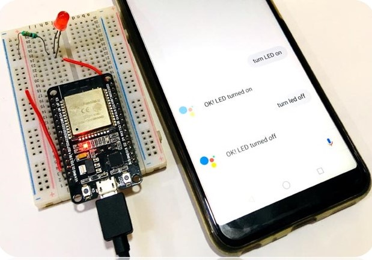

# Google-Assistant-Controlled-LED

A MINI VERSION OF HOUSE AUTOMATION USING GOOGLE ASSISTANT…... IT’S MINI BECAUSE HERE WE ARE  ONLY CONTROLLING “LED” AND NOT THE WHOLE HOUSE SYSTEM.

we will use Google Assistant with Adafruit IO to control an LED with ESP32. Here we have used IFTTT to access Google Assistant and to control LED by voice commands. 

FOR MORE DETAILS: refer presentation

